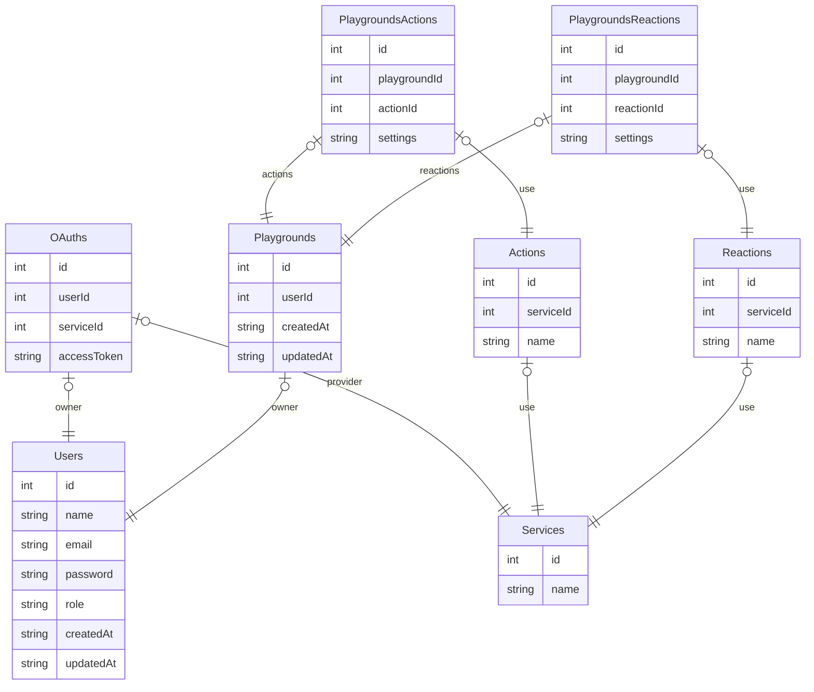

# Database

## Tech Stack

- Powerful and open-source relational database
- Supports JSON and JSONB data types

## Schema

```mermaid
erDiagram

Users {
    int id
    string name
    string email
    string password
    string role
    string createdAt
    string updatedAt
}

Services {
    int id
    string name
}

OAuths {
    int id
    int userId
    int serviceId
    string accessToken
}
OAuths |o--|| Users : owner
OAuths |o--|| Services : provider

Actions {
    int id
    int serviceId
    string name
}
Actions |o--|| Services : use

Reactions {
    int id
    int serviceId
    string name
}
Reactions |o--|| Services : use

Playgrounds {
    int id
    int userId
    string createdAt
    string updatedAt
}
Playgrounds |o--|| Users : owner

PlaygroundsActions {
    int id
    int playgroundId
    int actionId
    string settings
}
PlaygroundsActions |o--|| Playgrounds : actions
PlaygroundsActions |o--|| Actions : use

PlaygroundsReactions {
    int id
    int playgroundId
    int reactionId
    string settings
}
PlaygroundsReactions |o--|| Playgrounds : reactions
PlaygroundsReactions |o--|| Reactions : use
```
