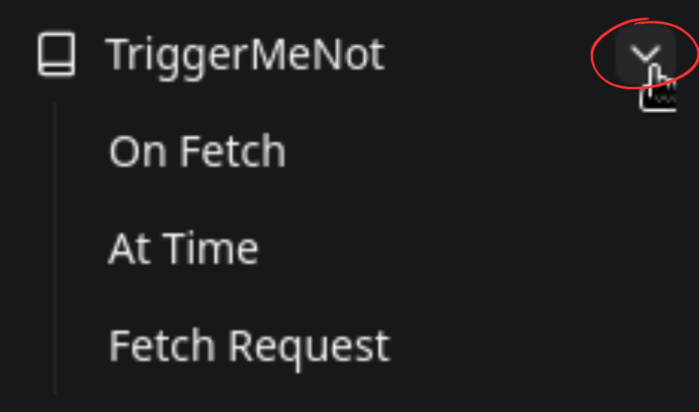

# Create a Node

## How to create a Node on desktop

There should be a sidebar on the right of your screen containing a list of all the services you can creates nodes for. If you don't have the sidebar, click on the little square on the top left of your screen (to the left of the "Home > Playground" text) to open it.

You can then scroll the list of available services to find the one you seek. Once this is done, click on the arrow to the right of the service name. It will open a list of all available actions for this service.

Put your mouse on top of the action you desire to use, click and drag your mouse to the canvas. You can then release your mouse. The node should appear on your canvas.

To get more informations about an action, you can click on its name. It will open a panel on the right of your screen with a description of the Node.

## How to create a Node on mobile

To create a Node on the mobile version, press the "Add Node" button at the top of the website.

It will open a list of all available services and corresponding actions/reactions.

Click on the action/reaction that you want to add to your canvas. Then, fill the relevant informations and click the "Create" button. The node should appear on your canvas.

## A little Node guide

A Node, upon addition to the canvas, will show these elements :

- The logo of the service at the center of the node,
- The name of the action displayed below it,
- A rectangle to the left of the Node if it can take an input,
- A round to the right of the Node if it can give an output.

