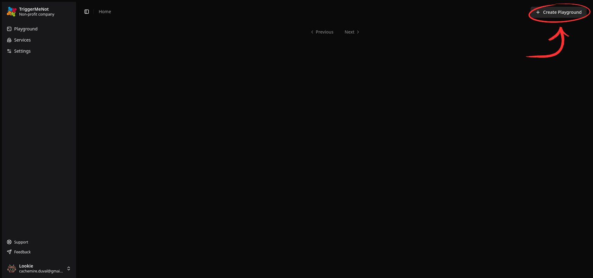

# Create a Playground

If you don't have a TriggerMeNot account yet, or are not logged in, follow [these](https://triggermenot.net/user-guide/register-login.html) instructions before continuing this guide.

## What is a Playground ?

A Playground is a canvas where you will be able to link nodes to create your custom automatisations.

## How to create a Playground

Creating a Playground is straightforward. Upon connection, you should get on the Playground page. If you are not on the Playground page, just click the "Playground" button in the sidebar on the left.

If your account is new, it will just be an empty page. Just click on the "Create Playground" button at the bottom right of your screen and you should have a blank canvas appear on your screen. This is your new Playground !

