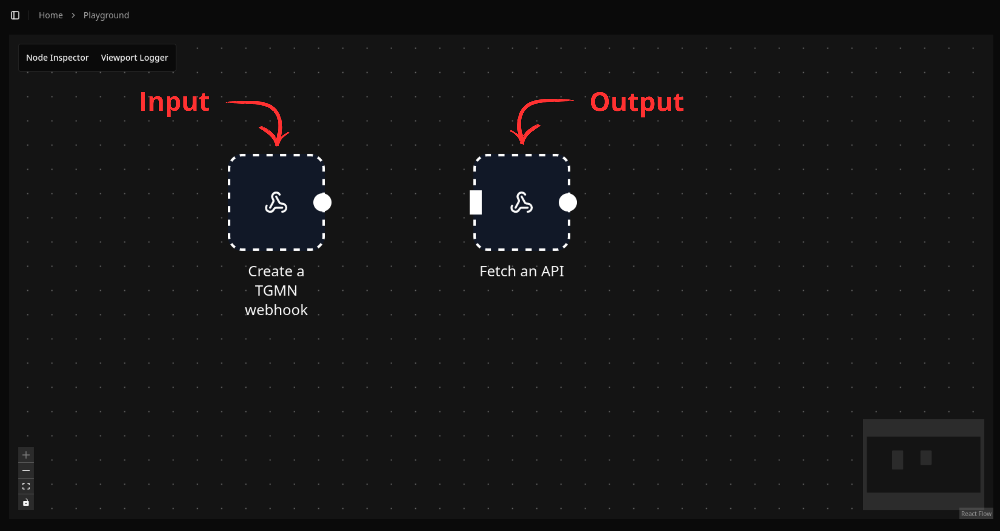
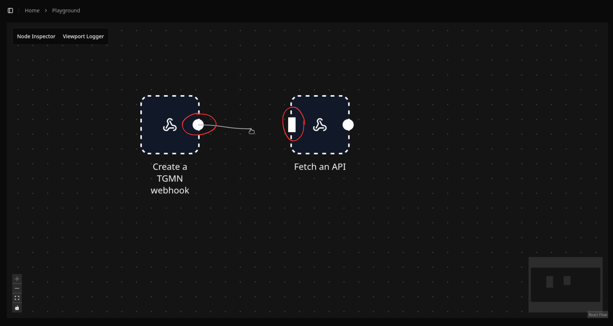
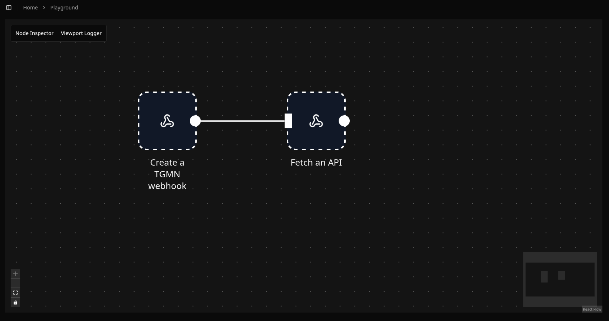

# Link Nodes

To be able to link nodes, be sure to have at least two nodes on your canvas. There should be at least a node that can take an input and a note that can give an output.

Place your mouse above the circle of the Node that you want to get the output from, and click. Without releasing, move your mouse to the top of the rectangle of the Node that you want to give the ouput to, and then release.

Congrats, you just linked two nodes ! Now go and link more.
