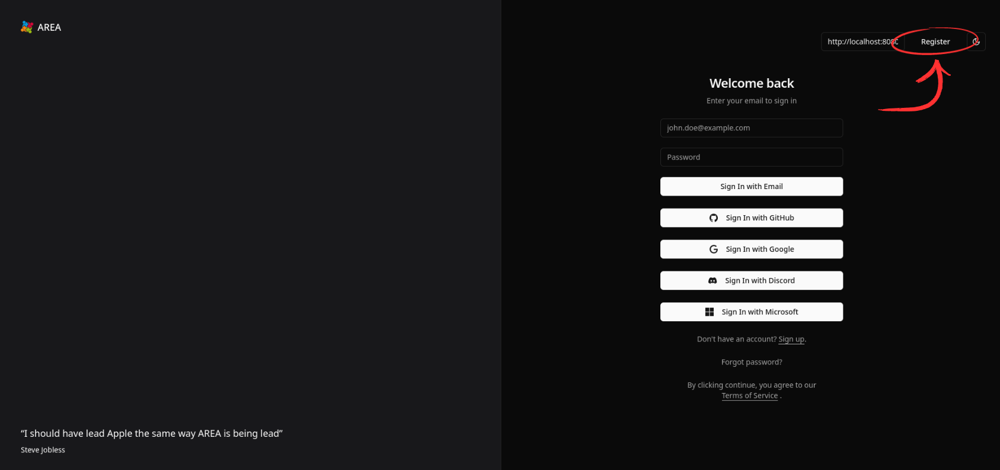

# Register/Login

There are two ways to create an account or login on TriggerMeNot. TriggerMeNot will open on the Login page by default, but if you don't have an account you can click on the "Register" button on the top right of the website.

## Using an Email adress

### Registering

To create an account using an email adress, get on the Register page and fill the form with the relevant informations needed :

- Your email adress,
- Your username,
- Your password.

You will need to enter your passwork twice to confirm it. Press the "Register with Email" button below the form and voilà !

You can then go back to the Login page by clicking on the top right "Login" button.

### Logging in

To log in using an email adress, first ensure that you already have a TriggerMeNot account.

You can then simply fill the form with the relevant informations needed to log in :

- The email adress you used to create your account,
- The password you gave when creating your account.

Press the "Sign in with Email" button below the form and you should be taken to your dashboard !

